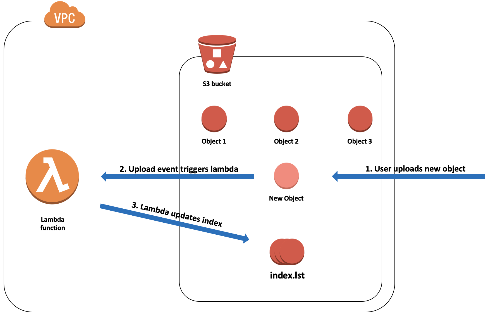
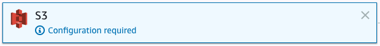
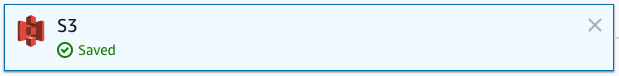
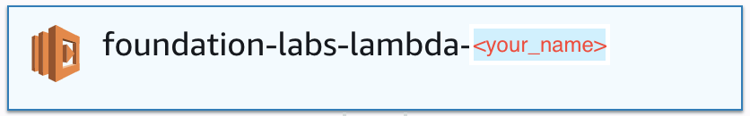
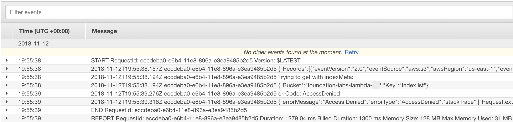

# AWS Lambda Lab
This lab is part of the [foundations trainings](https://github.com/octo-technology-downunder/octo-au-foundations) at [OCTO Technology Australia](http://careers.octo.com.au/).

## The Goal
In this lab we'll need to create a serverless application using AWS Lambda service which will react on events from S3 service. It will also respond to HTTP requests from AWS API Gateway<br>
That will cover the following topics:
- Working with AWS Lambda service via AWS console
- Creating a simple lambda function with S3 event trigger

This lab will take approximately 60 minutes

## Overview of technology
AWS provides a set of managed services which do not require infrastructure setup and management. Such services are usually referenced as `serverless`. These include:
- Lambda functions - pieces of code which are run on demand in containers hidden from lambda's owner
- S3 - serverless blob storage
- API Gateway - handles API calls from internet and directs them to other services, e.g. Lambda, S3, EC2

Now let's dive into the world of serverless technology :)

## **_Exercise:_ Create a S3 bucket indexer using Lambda function**
In this exercise we're going to create a simple application which will react on uploading events in S3 bucket and write a object's key into `index.lst` file in the same bucket<br>

Few things to mention:
* logic of the app is a basic one, no complex cases
* we want to ignore events for the `index.lst` file to avoid indefinite loop

### Create S3 bucket
* In AWS Console, go to `S3` service, then click `Create bucket`
* Type `foundation-labs-lambda-<your_name>` in the `Bucket name` field (don't forget to replace <your_name> with your name ;) )
* Leave all other parameters as default and create the bucket

### Create lambda function skeleton
* In AWS Console, go to `Lambda` service, then click `Create function`
* Select `Author from scratch`
* Set `Name` as `foundation-labs-lambda-<your_name>`
* Set `Runtime` as `Node.js 8.10`
* Set `Role` to `Create a new role from one or more templates.`
* Set `Role name` as `foundation-labs-lambda-role-<your_name>`
* Choose `Amazon S3 object read-only permissions` in `Policy templates`
* Click `Create function`

### Modify lambda role
We'll need to add write permissions to our lambda's role to allow it create/modify objects in our bucket
* In AWS Console, go to `IAM` service, then click `Roles` on the left panel
* Find your `foundation-labs-lambda-role-<your_name>` role in the list, then click on it
* Click `Add inline policy`. Then in `JSON` tab put following code (replace <your_name>):
```
{
    "Version": "2012-10-17",
    "Statement": [
        {
            "Sid": "GetAndPut",
            "Effect": "Allow",
            "Action": [
                "s3:*
            ],
            "Resource": "arn:aws:s3:::foundation-labs-lambda-<your_name>*"
        }
    ]
}
```
* Click `Review policy`, then type `foundation-labs-lambda-s3-policy-<your_name>` in the `name` field
* Click `Save changes`


### Create S3 put object event
Now let's create a trigger for our lambda function. That will be a reaction to object uploads into our bucket.<br> _For the sake of simplicity, we'll not distinguish between new objects and new versions of existing objects_
* On our lambda function screen, find `Designer` section and on the left side of it click on `S3` in `Add triggers` menu. That should add a S3 configuration block:<br>

* Click on that block and scroll down to `Configure triggers` section
* Set `bucket` field as `foundation-labs-lambda-<your_name>`
* Set `Event type` as `Object Created (All)`
* Make sure that `Enable trigger` is ticked
* Click `Add`, then click `Same` in the top right corner. That should save all changes:<br>


### Write lambda code
It's time to write some code! Our function will need to S3 put object event, sample of which could be found in AWS Documentation (see [Event samples](https://docs.aws.amazon.com/lambda/latest/dg/eventsources.html#eventsources-s3-put)). For simplicity, here is a stripped version of the sample with only fields which we'll need in our exercise:<br>
```
{
  "Records": [
    {
      "s3": {
        "object": {
          "key": "HappyFace.jpg",
          ...
        },
        "bucket": {
          "name": "sourcebucket",
          ...
        },
        ...
      },
      ...
    }
  ]
}
```
Keeping this in mind, please write the code. Here are the guidelines for that:
* First of all, make sure you have your Node.js and NPM utilities installed. If not, follow [these](https://nodejs.org/en/download/) instructions
* Open a Node.js project from `exercise1` directory of this repo (`master` branch) and run `npm install`
* Open index.js and write down the code of the app
* There are only 2 api calls to S3 which will be required:
  * [getObject](https://docs.aws.amazon.com/AWSJavaScriptSDK/latest/AWS/S3.html#getObject-property) to get current `index.lst` from the bucket
  * [putObject](https://docs.aws.amazon.com/AWSJavaScriptSDK/latest/AWS/S3.html#putObject-property) to put updated `index.lst` back to the bucket
* To help you with the task, we have set up a suite of unit tests, so you need to make them green
* To run your tests, open your terminal, `cd` to the `exercise1` directory and run `npm test`
* Don't use any additional libraries or create any additional files - you just don't need them for that simple exercise! KISS!
* Don't move `new AWS.S3();` outside of handler function - that will brake tests

### Upload lambda code to AWS
If you managed to get your tests all green, go ahead and upload the code of `index.js` into your lambda function:
* In AWS Console, go to `Lambda` service, then open your function `foundation-labs-lambda-<your_name>`
* Click on the block with your function name:<br>
* Scroll down to `Function code` block and paste there contents of your `index.js`
* Click Save in right top corner

### Test your lambda
Once all steps are completed, we can see how our indexer works:
* In AWS Console, go to S3, then to your bucket
* Upload any file to our bucket
* Check if `index.lst` is created in the root of the bucket and contains uploaded file name

### Debug your lambda
If you don't see `index.lst` created, you will need to troubleshoot your lambda by going to CloudWatch logs. For the purpose of this exercise we'll see anyway how logs look like there:
* On your lambda function main screen, click on `Monitoring` tab, then click on `View logs in CloudWatch`
* It should navigate you to the `Cloudwatch` -> `Logs` section and display a list of log streams for your lambda. AWS Navigation path should display something like<br>`CloudWatch > Log Groups > Streams for /aws/lambda/foundation-labs...`
* Click on the stream with the latest `Last Event Time`
* Here you can see related logs and execution errors if any<br>


### Congratulations!!! You've successfully created and tested a load balanced application!
If everything is done properly and debugged, your indexer application should work!

<br>


## Using Serverless framework
The approach to developing lambda functions described above is straightforward and a bit tedious. There are however frameworks in the market that streamlines creation of the serverless applications. [*Serverless*](https://serverless.com/) framework is one of them. It allows to define all steps we did manually in this exercise (and much more) as a code, in simple and easy to understand form. We recommend have a look on quick [REST API tutorial](https://serverless.com/blog/serverless-express-rest-api/) in their blog
